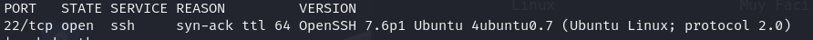
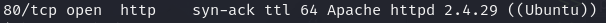
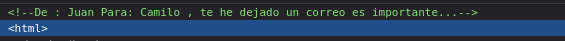
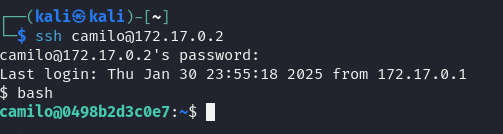
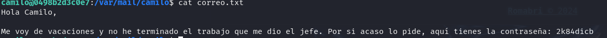
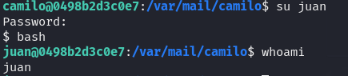
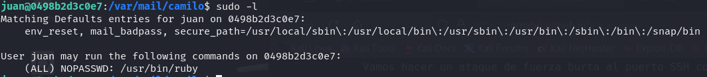
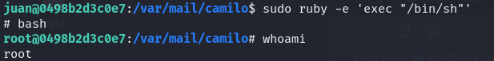

Explotacion de vulnerabilidad.

-- Maquina perteneciente a: https://dockerlabs.es/
-- Nombre de la maquina: Vacaciones
-- Dificultad: muy fàcil
-- Autor: Romabri

### Escaneo y reconocimiento de puertos.

nmap -p- --open -sS -sC -sV --min-rate=5000 -vvv -n -Pn -oN escaneo 172.17.0.2

-p-: Busqueda de puertos abiertos

--open: Enumera los puertos abiertos

-sS: Es un modo de escaneo rapido

-sC: Que use un conjunto de scripts de reconocimiento

-sV: Que encuentre la version del servicio activo

--min-rate=5000: Hace que el reconocimiento vaya aun mas rapido mandando no menos de 5000 paquetes

-vvv: Muestra en pantalla a medida que encuentre puertos

-n: No hace resolucion DNS 

-Pn: No hace ping

-- Tanto puerto 22 como 80 estan abiertos

### Puerto 80.

-- Al no mostrar nada la pagina web, se prueba hacer fuzzing con gobuster
-- Se usa Gobuster para reconocimiento web y ver que directorios se pueden encontrar en dicho sitio.

gobuster dir -u http://172.17.0.2/ -w /usr/share/wordlists/dirbuster/directory-list-2.3-medium.txt -x php

gobuster dir - Indica que estás utilizando la herramienta Gobuster para realizar un escaneo de directorios
-u http://172.20.10.5/ Especifica la URL objetivo que deseas escanear en busca de directorios
-w Especifica que diccionario queremos usar
-x Para indicar que tipo de extension queremos que nos encuentre

Gobuster no encuentra nada, pero inspeccionando el codigo de la pagina, nos encontramos con algo.

Tenemos 2 posibles usuarios, 'juan' y 'camilo'.

### Intrusión y escalada de privilegios.

Se hace un ataque de fuerza bruta al pueto SSH con Medusa de los 2 usuarios para ver si encontramos las credenciales.

medusa -h 172.17.0.2 -u camilo,juan -P /usr/share/wordlists/rockyou.txt -M ssh

medusa: Nombre de la herramienta

-h 172.17.0.2: especifica el host o IP objetivo

-u camilo,juan: especifica los nombre de usuario con los que Medusa intentara autenticarse

-P: Le indica a Medusa que archivo de contraseñas usar.

-M ssh: Especifica el modulo o servicio que Medusa atacará

-- Se encuentra que con Camilo puede acceder via SSH con la contraseña password1.

-- Ingresamos

-- Se busca el correo que recibio, dirigiendonos a /var/mail/camilo

-- Encontramos el siguiente correo.

-- Ahora que tenemos la contraseña, cambiamos de usuario a 'juan'.

-- Al hacer sudo -l, se ve, que se puede usar ruby para escalada de privilegios.

-- Ahora escalamos privilegios con ruby.

Maquina vulnerada.
